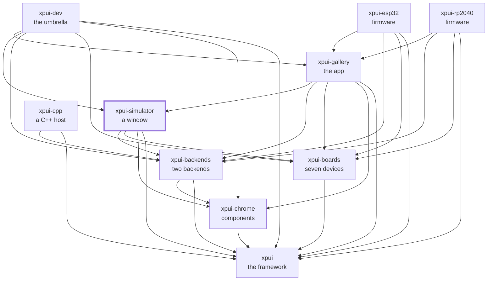

[](https://github.com/XPUI-Framework/xpui-simulator/actions/workflows/ci.yml) [](LICENSE)

<picture>
  <source media="(prefers-color-scheme: dark)" srcset="assets/logo-black.png">
  
</picture>

# Simulator

> [!WARNING]
> Under heavy development. Not production-ready. The API can break without
> notice. Use at your own risk.

Runs an [`xpui`](https://github.com/XPUI-Framework/xpui-framework) app in a
desktop window, so screens can be developed without hardware. Not a separate
rendering backend: it is
[`xpui-embedded-graphics`](https://github.com/XPUI-Framework/xpui-backends/tree/main/embedded_graphics)
over [`embedded-graphics-simulator`](https://crates.io/crates/embedded-graphics-simulator)'s display, plus a window, an event pump and
a keyboard mapping. **The pixels are the ones a device would get** — same
backend, same components, same measurements.

Every document in this repository is listed in [docs/README.md](docs/README.md).

## Using it

```toml
[dependencies]
xpui-simulator = { git = "https://github.com/XPUI-Framework/xpui-simulator", branch = "main" }
```

```rust,no_run
# use xpui::{Screen, Text, View};
# struct MainMenu;
# impl MainMenu { fn new() -> Self { MainMenu } }
# impl Screen for MainMenu {
#     type Message = ();
#     fn body(&self) -> impl View<()> { Text::new("Main menu") }
#     fn update(&mut self, _message: ()) {}
# }
use xpui_simulator::{Board, Panel, Simulator};

fn main() {
    // Your panel. `xpui-boards-pimoroni`, `-xteink` and `-seeed` carry
    // ready-made ones.
    let mine = Board::custom("my reader", 480, 800, false);
    Simulator::new(Panel::of(mine))
        .title("my reader")
        .run(MainMenu::new());
}
```

`cargo run -p xpui-gallery` — the seven-board gallery this window was built
around — lives in [`xpui-gallery`](https://github.com/XPUI-Framework/xpui-gallery),
not here; this crate knows no device and no screen, and opens whatever board
and screen it is handed. Nothing is on [crates.io](https://crates.io/) yet, which is why the
dependency is a `git` URL.

## Requirements

[SDL2](https://www.libsdl.org/), which `embedded-graphics-simulator` needs.

```bash
brew install sdl2                # macOS
sudo apt install libsdl2-dev     # Debian/Ubuntu
```

## Checking it

```bash
./build-and-test.sh
```

The checks themselves are in [`xtask/`](xtask/) — this repository's own list,
in [Rust](https://rust-lang.org/), holding nothing it does not run. There is no bare-metal lint here and
there is no C++ stage: this crate opens a window, and runs on a desktop and
nowhere else. `./build-and-test.sh fix` formats in place first. How a change
is reviewed is in [docs/contributing.md](docs/contributing.md).

## Where it sits

Every arrow is a dependency in a `Cargo.toml`, and they all point inward
toward `xpui`, which depends on nothing at all. That is the rule the
organisation is arranged around: a backend can be written without the framework
knowing it exists, and a firmware reaches whatever it needs directly rather
than through whoever happens to sit above it.



## License

MIT — see [LICENSE](LICENSE). Copyright (c) 2026 Thiago Holanda.
